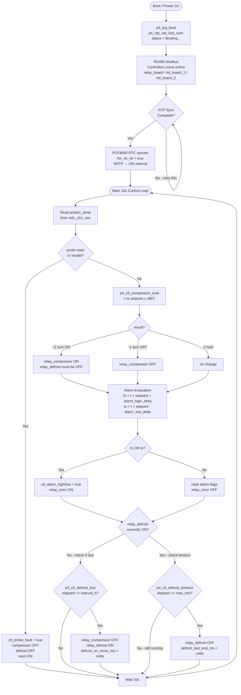
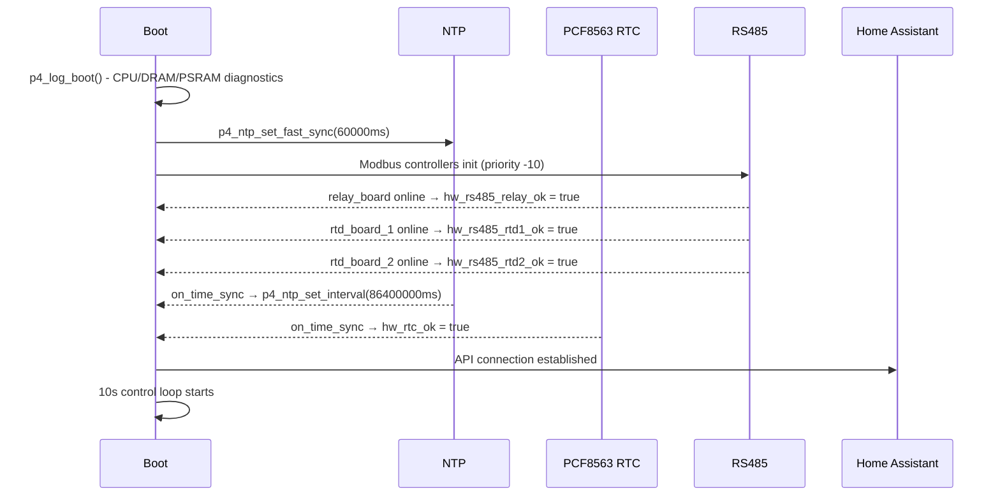
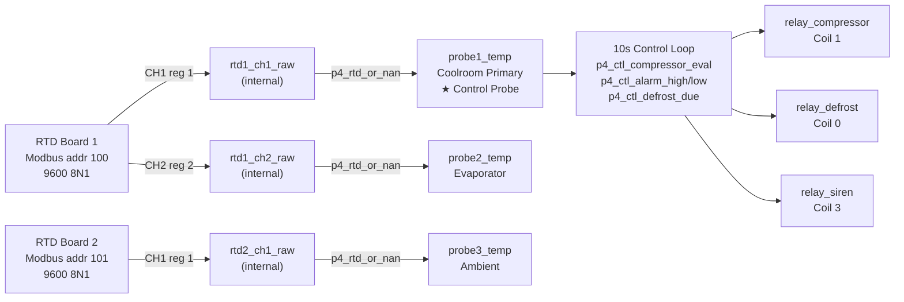

# Program Control Logic Flowchart
# ESP32-P4 Coolroom Controller

---

## Boot Sequence Detail

---

## Probe / Sensor Architecture

---

## Phase Summary

| Phase | Description                                | Status      |
|-------|--------------------------------------------|-------------|
| 1     | WiFi, HA API, web server, OTA              | ✅ Complete |
| 2     | RS485 Modbus: relays + 3x RTD probes, RTC  | ✅ Complete |
| 3     | Coolroom control logic                     | ✅ Complete |
| 4     | LVGL 7" MIPI-DSI touchscreen UI            | ✅ Complete |
| 5     | SD card logging, ntfy, backup/restore      | ✅ Complete |
| 6     | Extended control: lockout, grace, smart defrost, fallback, ice, no-cool | 🔄 Current |
| 7     | Diagnostic sensors + RS485 health + select entities | ⏳ Next |
| 8     | LVGL multi-page UI (home meter + settings + system pages) | ⏳ Planned |
