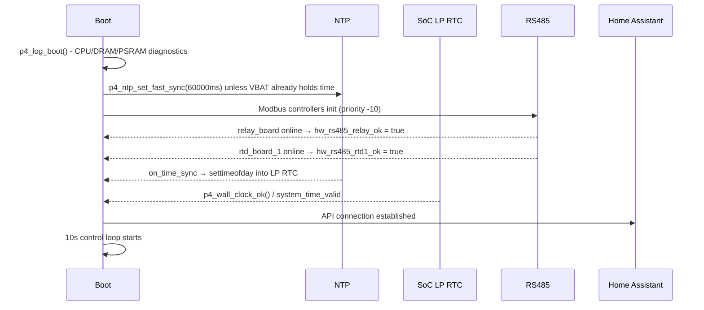
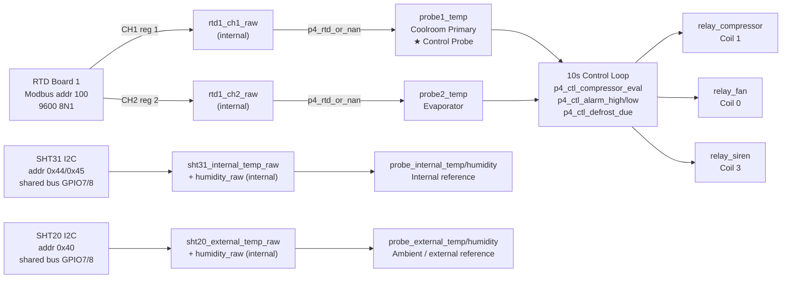

# Program Control Logic Flowchart
# ESP32-P4 Coolroom Controller

```mermaid
flowchart TD
    BOOT([Boot / Power On]) --> INIT[p4_log_boot\np4_ntp_set_fast_sync\nstatus = Booting...]
    INIT --> RS485[RS485 Modbus\nControllers come online\nrelay_board / rtd_board_1]
    RS485 --> NTP{NTP Sync\nComplete?}
    NTP -->|No - retry 60s| NTP
    NTP -->|Yes| RTC[SoC LP RTC updated\nwall clock valid\nSNTP → weekly interval]
    RTC --> LOOP

    LOOP([Main 10s Control Loop])

    LOOP --> P1[Read probe1_temp\nfrom rtd1_ch1_raw]
    P1 --> FAULT{probe stale\nor invalid?}

    FAULT -->|Yes| PFERR[ctl_probe_fault = true\ncompressor OFF\ndefrost OFF\nsiren ON]
    PFERR --> WAIT10[Wait 10s]
    WAIT10 --> LOOP

    FAULT -->|No| COMP[p4_ctl_compressor_eval\nON at SP+diff / OFF at SP]

    COMP --> C1{result?}
    C1 -->|+1 turn ON| CON[relay_compressor ON\n(fan follows if enabled)]
    C1 -->|-1 turn OFF| COFF[relay_compressor OFF]
    C1 -->|0 hold| CHOLD[no change]
    CON --> ALM
    COFF --> ALM
    CHOLD --> ALM

    ALM[Alarm Evaluation\nhi = t > setpoint + alarm_high_delta\nlo = t < setpoint - alarm_low_delta]
    ALM --> A1{hi OR lo?}
    A1 -->|Yes| SIREON[ctl_alarm_high/low = true\nrelay_siren ON]
    A1 -->|No| SIREOFF[clear alarm flags\nrelay_siren OFF]
    SIREON --> DEFCHK
    SIREOFF --> DEFCHK

    DEFCHK{relay_fan\ncurrently ON?}
    DEFCHK -->|No - check if due| DEFDUE{p4_ctl_defrost_due\nelapsed >= interval_h?}
    DEFDUE -->|No| WAIT10
    DEFDUE -->|Yes| DEFSTART[relay_compressor OFF\nrelay_fan OFF (passive)\ndefrost_on_since_ms = millis]
    DEFSTART --> WAIT10

    DEFCHK -->|Yes - check timeout| DEFTMO{p4_ctl_defrost_timeout\nelapsed >= max_min?}
    DEFTMO -->|No - still running| WAIT10
    DEFTMO -->|Yes| DEFEND[ctl_defrost_active = false\ndefrost_last_end_ms = millis]
    DEFEND --> WAIT10
```

---

## Boot Sequence Detail

```mermaid
sequenceDiagram
    participant Boot
    participant NTP
    participant Clock as SoC LP RTC
    participant RS485
    participant HA as Home Assistant

    Boot->>Boot: p4_log_boot() - CPU/DRAM/PSRAM diagnostics
    Boot->>NTP: p4_ntp_set_fast_sync(60000ms) unless VBAT already holds time
    Boot->>RS485: Modbus controllers init (priority -10)
    RS485-->>Boot: relay_board online → hw_rs485_relay_ok = true
    RS485-->>Boot: rtd_board_1 online → hw_rs485_rtd1_ok = true
    NTP-->>Boot: on_time_sync → settimeofday into LP RTC
    Clock-->>Boot: p4_wall_clock_ok() / system_time_valid
    Boot->>HA: API connection established
    Boot->>Boot: 10s control loop starts
```

---

## Probe / Sensor Architecture

```mermaid
graph LR
    RTD1["RTD Board 1\nModbus addr 100\n9600 8N1"] -->|CH1 reg 1| R1C1["rtd1_ch1_raw\n(internal)"]
    RTD1 -->|CH2 reg 2| R1C2["rtd1_ch2_raw\n(internal)"]
    SHT31["SHT31 I2C\naddr 0x44/0x45\nshared bus GPIO7/8"] --> S31R["sht31_internal_temp_raw\n+ humidity_raw (internal)"]
    SHT20["SHT20 I2C\naddr 0x40\nshared bus GPIO7/8"] --> S20R["sht20_external_temp_raw\n+ humidity_raw (internal)"]

    R1C1 -->|p4_rtd_or_nan| P1["probe1_temp\nCoolroom Primary\n★ Control Probe"]
    R1C2 -->|p4_rtd_or_nan| P2["probe2_temp\nEvaporator"]
    S31R --> P3I["probe_internal_temp/humidity\nInternal reference"]
    S20R --> P3E["probe_external_temp/humidity\nAmbient / external reference"]

    P1 --> CTL["10s Control Loop\np4_ctl_compressor_eval\np4_ctl_alarm_high/low\np4_ctl_defrost_due"]
    P2 --> CTL
    CTL --> REL1["relay_compressor\nCoil 1"]
    CTL --> REL0["relay_fan\nCoil 0"]
    CTL --> REL3["relay_siren\nCoil 3"]
```

Note: the dedicated ambient RTD board (RS485 slave 101, formerly `probe3_temp`) has been
decommissioned. `probe_external_temp` (SHT20) now fills the ambient/external role and drives
`home_ambient_arc` on the LVGL display — see `reference/hardware_pins.md` for the I2C wiring.
Only `probe1_temp` and `probe2_temp` feed the 10s control loop; the I2C sensors are
display/logging-only (see `reference/session_recaps.md`, 2026-07-24 entry, for what was
deliberately not wired into control logic).

## Offline Operation Notes

- Main control decisions are local and run from the 10s loop regardless of Wi-Fi/HA state.
- Wi-Fi/API disconnect is non-fatal (`reboot_timeout: 0s`) and must not restart firmware.
- Network push notifications are best-effort and only attempted when Wi-Fi is connected.

---

## Phase Summary

| Phase | Description                                | Status      |
|-------|--------------------------------------------|-------------|
| 1     | WiFi, HA API, web server, OTA              | ✅ Complete |
| 2     | RS485 Modbus: relays + 2x RTD probes, RTC  | ✅ Complete |
| 3     | Coolroom control logic                     | ✅ Complete |
| 4     | LVGL 7" MIPI-DSI touchscreen UI            | ✅ Complete |
| 5     | SD card logging, ntfy, backup/restore      | ✅ Complete |
| 6     | Extended control: lockout, grace, smart defrost, fallback, ice, no-cool | ✅ Complete |
| 7     | Diagnostic sensors + RS485 health + select entities | ✅ Complete |
| 8     | LVGL multi-page UI (home meter + settings + system pages) | ✅ Complete |
| 9     | LVGL page navigation (script-based state + tab bar wiring) | ✅ Complete |
| 10    | Extended diagnostic page (system heap, PSRAM, uptime, WiFi signal) | ✅ Complete |
| 11    | Web dashboard + JSON time-series API (24h trends, metrics) | ✅ Complete |
